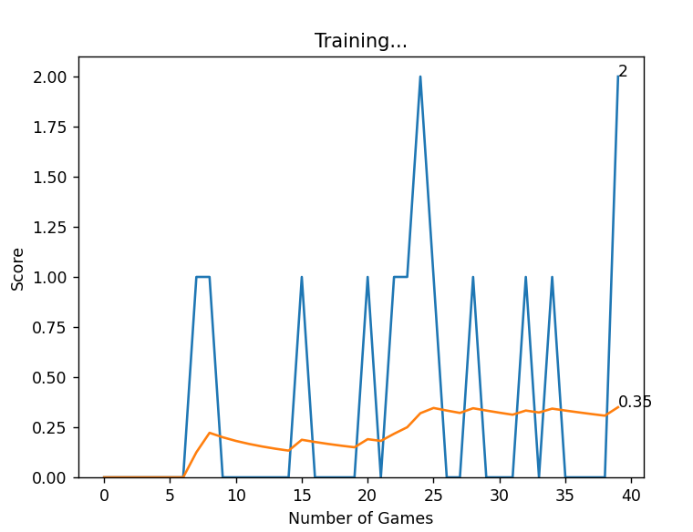
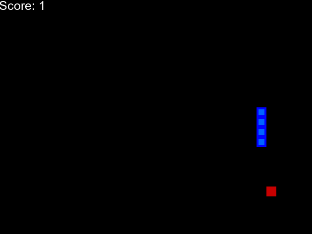

# Snake Game wit AI

In this tutorial, I delve into the exciting realm of teaching an AI to play the classic game of Snake using reinforcement learning techniques. By combining the power of PyTorch and Pygame, I will guide you through the process of creating an intelligent agent that learns to navigate and collect food in the Snake game.

I begun by establishing the fundamental concepts of reinforcement learning and its components: the agent, environment, states, actions, and rewards. Then, I explored how to represent the Snake game as an environment and design the neural network architecture using PyTorch to train our agent.

Throughout the tutorial, I covered crucial topics such as Q-learning, exploration vs. exploitation, and experience replay to improve our agent's learning process. I also provided insightful tips on optimizing the training process and visualizing the agent's performance.

By the end, we have a complete understanding of how to train an AI agent to master Snake using reinforcement learning techniques, PyTorch, and Pygame. Let's embark on this thrilling journey into the world of AI and gaming!

## Views

  

  

## Setup

- Clone the project: `git@github.com:rOluochKe/snake-game-with-ai.git`
- Change directory into : `cd /snake-game-with-ai`
- Create your environment and install dependencies: `pip install -r requirements.txt`
- Run the game: `python agent.py`
